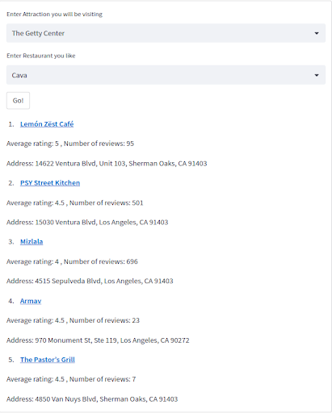
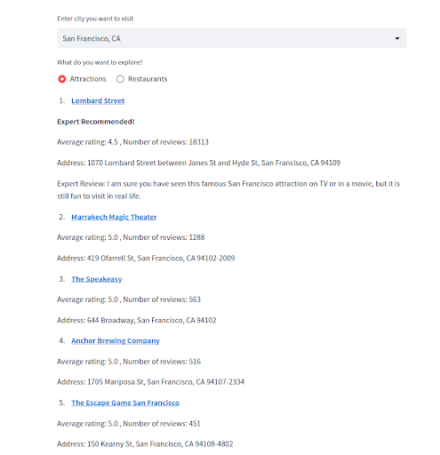
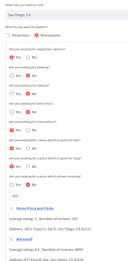

# ZIP-Find
Final Project for DSCI558 (Building Knowledge Graphs) at USC in fall 2022 semester. ZIP-Find is a location based restaurant search and recommendation system. You can find a quick demo for the project [here](https://www.youtube.com/watch?v=DCmRJGSix38).

## Team Members
* Praveen Iyer (MS Applied Data Science)
* Sankalp Sharma (MS Applied Data Science)

## Tools and Technologies Used
1. Data Scraping
    * Beautiful Soup for scraping expert recommended attractions
    * Scrapy spiders for crawling static data
    * Selenium to scrape all amenties from yelp website which loads dynamicaly based on a button click
2. Record Linkage/ Entity Linking
    * RLTK
3. Knowledge Graphs
    * Neo4J AuraDB clod database for storing data
    * Cypher queries
4. Streamlit for building the User Interface
## Data Sources
1. Structured data source for extracting zip codes and nearby zip code information in California from:
    * https://www.unitedstateszipcodes.org/ca/
2. Restaurants in California using Yelp website:
    * https://www.yelp.com/
3. Top attractions in California using Tripadvisor website:
    * https://www.tripadvisor.com/Attractions-g28926-Activities-a_allAttractions.true-California.html
4. Expert recommednded attractions from:
    * https://californiathroughmylens.com/strange-fun-attractions-list/
    * https://californiathroughmylens.com/strange-unique-northern-california/

## About the application
In this project, we have built a knowledge graph about restaurants and local attractions located in different cities of California. Our knowledge graph will model the relationship betweenzip codes, cities, restaurants and attractions. We have built a system which provides the following functionalities:
1. __Input__ - Attraction user wants to visit, Restaurant user likes 
   __Output__ - Top 5 most similar restauarnts near the attraction (The results are sorted by similarity)

   

2. __Input__ - City user wants to visit 
   __Output__ - Top 5 rated attractions in the city (The results are sorted by expert recommendation first, then by average rating and number of reviews)

   

3. __Input__ - City user wants to visit, Select "Yes" or "No" from a list of questions 
    * Looking for Vegetarian options?
    * Looking for parking?
    * Looking for takeout?
    * Looking for drive-thru?
    * Looking for reservations?
    * Looking for a place which is good for kids?
    * Looking for a place where dogs are allowed?
    * Looking for a place where smoking is allowed?

   __Output__ - Top 5 rated restauarants in the city which satisfy the filters (The results are sorted by average rating and number of reviews)

   